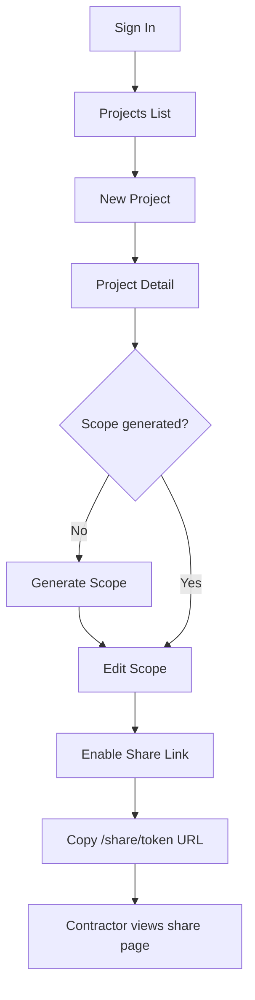

# ScopeBuddy — Architecture

## Overview

ScopeBuddy is a Next.js full-stack application that helps homeowners define construction projects and share contractor-ready scopes.

| Layer | Technology |
|---|---|
| Framework | Next.js 14+ (App Router) |
| Language | TypeScript |
| Styling | Tailwind CSS + shadcn/ui |
| Auth | Clerk |
| Database | Supabase Postgres |
| Storage | Supabase Storage *(Phase 2)* |
| AI | OpenAI API (structured JSON, server-side only) |
| Hosting | Vercel |

## Roles

| Role | Description |
|---|---|
| `homeowner` | Authenticated account; creates and manages projects |
| `contractor` | Level 0–2 access *(Phase 3+)*; Phase 1 is read-only via share link |
| `admin` | Internal operations |

### Admin screen catalog

Admins can browse and iframe-preview homeowner and contractor pages with mock data at `/adminpanel/screens`. When adding a new user-facing page under `(dashboard)/`, `(contractor)/`, or `review/`, update the catalog — see [docs/ADMIN_SCREEN_CATALOG.md](./docs/ADMIN_SCREEN_CATALOG.md). CI enforces sync via `npm run check:screen-catalog`.

### Contractor Access Levels *(Phase 3+)*

| Level | Requirements | Capabilities |
|---|---|---|
| Level 0 | None | View scope, view photos |
| Level 1 | Name, email, company name | Suggest scope changes, create estimates, submit bids |
| Level 2 | Full account | Save estimates, templates, labor rates, manage projects |

## Folder Structure

```
/app
  /(auth)                    # Clerk sign-in/up
  /(dashboard)                 # Authenticated homeowner routes
    /projects
      /new
      /[id]
      /[id]/scope
  /share/[token]               # Public read-only share view
  /api
    /projects
    /projects/[id]
    /projects/[id]/generate-scope
    /projects/[id]/scope-items
    /projects/[id]/share
/components
  /ui                          # shadcn/ui primitives
  /layout                      # Header, nav, shell
  /project                     # Project forms, cards, list
  /scope                       # Scope editor, item rows
  /share                       # Public share view components
/lib
  /ai                          # OpenAI client, prompt loading
  /db                          # Supabase client, queries
  /auth                        # Clerk helpers, role checks
  /security                    # Token generation, validation
  /validators                  # Zod schemas
/prompts                       # Versioned AI prompt templates
/types                         # Shared TypeScript types
/public
/supabase
  /migrations                  # SQL migration files
```

## Full Database Schema (All Phases)

Tables below represent the complete product vision. **Phase 1 implements only the tables marked ?.**

### `users` ? Phase 1

Synced from Clerk via webhook or created on first login.

| Column | Type | Notes |
|---|---|---|
| `id` | `uuid` PK | Matches Clerk `userId` or internal UUID linked to Clerk |
| `email` | `text` NOT NULL UNIQUE | |
| `name` | `text` | |
| `role` | `text` NOT NULL DEFAULT `'homeowner'` | `homeowner`, `contractor`, `admin` |
| `created_at` | `timestamptz` DEFAULT `now()` | |

### `projects` ? Phase 1

| Column | Type | Notes |
|---|---|---|
| `id` | `uuid` PK DEFAULT `gen_random_uuid()` | |
| `homeowner_id` | `uuid` FK ? `users.id` NOT NULL | |
| `title` | `text` NOT NULL | |
| `project_type` | `text` NOT NULL | e.g. `kitchen`, `bathroom`, `deck`, `other` |
| `city` | `text` NOT NULL | No full address |
| `zip` | `text` NOT NULL | |
| `original_description` | `text` NOT NULL | Homeowner's raw input |
| `ai_summary` | `text` | AI-generated project summary |
| `status` | `text` NOT NULL DEFAULT `'draft'` | `draft`, `scope_ready`, `shared`, `archived` |
| `share_token` | `text` UNIQUE | Cryptographically random; nullable until shared |
| `share_enabled` | `boolean` DEFAULT `false` | |
| `share_expires_at` | `timestamptz` | Nullable; no expiry if null |
| `created_at` | `timestamptz` DEFAULT `now()` | |
| `updated_at` | `timestamptz` DEFAULT `now()` | |

### `scope_items` ? Phase 1

| Column | Type | Notes |
|---|---|---|
| `id` | `uuid` PK DEFAULT `gen_random_uuid()` | |
| `project_id` | `uuid` FK ? `projects.id` ON DELETE CASCADE | |
| `category` | `text` NOT NULL | e.g. `demolition`, `plumbing`, `electrical` |
| `text` | `text` NOT NULL | Scope item description |
| `source` | `text` NOT NULL DEFAULT `'ai'` | `ai`, `homeowner`, `contractor` |
| `priority` | `text` DEFAULT `'recommended'` | `required`, `recommended`, `optional` |
| `status` | `text` NOT NULL DEFAULT `'active'` | `active`, `removed` |
| `sort_order` | `integer` NOT NULL DEFAULT `0` | |
| `needs_verification` | `boolean` DEFAULT `false` | AI uncertainty flag |
| `created_at` | `timestamptz` DEFAULT `now()` | |
| `updated_at` | `timestamptz` DEFAULT `now()` | |

### `ai_runs` ? Phase 1

| Column | Type | Notes |
|---|---|---|
| `id` | `uuid` PK DEFAULT `gen_random_uuid()` | |
| `project_id` | `uuid` FK ? `projects.id` ON DELETE CASCADE | |
| `prompt_version` | `text` NOT NULL | e.g. `scope-v1` |
| `model` | `text` NOT NULL | e.g. `gpt-4o` |
| `input_snapshot` | `jsonb` NOT NULL | Description + metadata sent to model |
| `output_snapshot` | `jsonb` NOT NULL | Raw structured JSON response |
| `created_at` | `timestamptz` DEFAULT `now()` | |

### `project_photos` — Phase 2

| Column | Type | Notes |
|---|---|---|
| `id` | `uuid` PK | |
| `project_id` | `uuid` FK → `projects.id` | |
| `storage_path` | `text` NOT NULL | Supabase Storage path |
| `file_name` | `text` NOT NULL | Original filename |
| `mime_type` | `text` NOT NULL | JPEG, PNG, WebP |
| `file_size` | `integer` NOT NULL | Bytes |
| `sort_order` | `integer` DEFAULT `0` | Display order |
| `created_at` | `timestamptz` | |

### `follow_up_questions` — Phase 2

Optional quote-improvement items. No aggregate score on `projects`.

| Column | Type | Notes |
|---|---|---|
| `id` | `uuid` PK | |
| `project_id` | `uuid` FK → `projects.id` | |
| `question` | `text` NOT NULL | |
| `question_type` | `text` | `text`, `choice`, `dimension_estimate` |
| `category` | `text` NOT NULL DEFAULT `'other'` | `dimensions`, `materials`, `timeline`, `permits`, `trade_scope`, `other` |
| `choices` | `jsonb` | For `choice` / `dimension_estimate` types |
| `answer` | `text` | Nullable until answered |
| `skipped` | `boolean` DEFAULT `false` | |
| `sort_order` | `integer` DEFAULT `0` | |
| `source` | `text` DEFAULT `'ai'` | `ai`, `homeowner` |
| `answered_at` | `timestamptz` | |
| `created_at` | `timestamptz` | |

### `contractor_invitations`  -  Phase 3

| Column | Type | Notes |
|---|---|---|
| `id` | `uuid` PK | |
| `project_id` | `uuid` FK ? `projects.id` | |
| `contractor_name` | `text` | |
| `contractor_email` | `text` | |
| `invitation_token` | `text` UNIQUE | |
| `status` | `text` | `pending`, `accepted`, `expired` |

### `contractor_reviews`  -  Phase 3

| Column | Type | Notes |
|---|---|---|
| `id` | `uuid` PK | |
| `project_id` | `uuid` FK ? `projects.id` | |
| `contractor_id` | `uuid` FK ? `users.id` | |
| `notes` | `text` | |

### `estimates`  -  Phase 5

| Column | Type | Notes |
|---|---|---|
| `id` | `uuid` PK | |
| `contractor_id` | `uuid` FK ? `users.id` | |
| `project_id` | `uuid` FK ? `projects.id` | |
| `total` | `numeric` | |
| `status` | `text` | `draft`, `submitted` |

### `estimate_line_items`  -  Phase 5

| Column | Type | Notes |
|---|---|---|
| `id` | `uuid` PK | |
| `estimate_id` | `uuid` FK ? `estimates.id` | |
| `description` | `text` | |
| `labor_cost` | `numeric` | |
| `material_cost` | `numeric` | |
| `total` | `numeric` | |

---

## Phase 1 Implementation Plan

### Goals

Deliver the Homeowner MVP: authenticated users can create a project, generate an AI scope, edit scope items, and share a secure read-only link.

### Out of Scope (Phase 1)

- Photo uploads
- "Information That Would Improve Quotes" checklist
- Follow-up / dimension questions
- Numerical completeness or quote-readiness scores
- Contractor invitations, reviews, or suggestions
- Estimates and pricing
- Contractor accounts (Level 1/2)
- AI photo analysis

---

### 1. Database Schema (Phase 1)

#### Migration: `001_phase1_initial.sql`

```sql
-- Enable UUID generation
CREATE EXTENSION IF NOT EXISTS "pgcrypto";

-- Users (synced from Clerk)
CREATE TABLE users (
  id          UUID PRIMARY KEY,
  email       TEXT NOT NULL UNIQUE,
  name        TEXT,
  role        TEXT NOT NULL DEFAULT 'homeowner'
              CHECK (role IN ('homeowner', 'contractor', 'admin')),
  created_at  TIMESTAMPTZ NOT NULL DEFAULT now()
);

-- Projects
CREATE TABLE projects (
  id                   UUID PRIMARY KEY DEFAULT gen_random_uuid(),
  homeowner_id         UUID NOT NULL REFERENCES users(id) ON DELETE CASCADE,
  title                TEXT NOT NULL,
  project_type         TEXT NOT NULL,
  city                 TEXT NOT NULL,
  zip                  TEXT NOT NULL,
  original_description TEXT NOT NULL,
  ai_summary           TEXT,
  status               TEXT NOT NULL DEFAULT 'draft'
                       CHECK (status IN ('draft', 'scope_ready', 'shared', 'archived')),
  share_token          TEXT UNIQUE,
  share_enabled        BOOLEAN NOT NULL DEFAULT false,
  share_expires_at     TIMESTAMPTZ,
  created_at           TIMESTAMPTZ NOT NULL DEFAULT now(),
  updated_at           TIMESTAMPTZ NOT NULL DEFAULT now()
);

CREATE INDEX idx_projects_homeowner ON projects(homeowner_id);
CREATE INDEX idx_projects_share_token ON projects(share_token) WHERE share_token IS NOT NULL;

-- Scope items
CREATE TABLE scope_items (
  id                 UUID PRIMARY KEY DEFAULT gen_random_uuid(),
  project_id         UUID NOT NULL REFERENCES projects(id) ON DELETE CASCADE,
  category           TEXT NOT NULL,
  text               TEXT NOT NULL,
  source             TEXT NOT NULL DEFAULT 'ai'
                     CHECK (source IN ('ai', 'homeowner', 'contractor')),
  priority           TEXT NOT NULL DEFAULT 'recommended'
                     CHECK (priority IN ('required', 'recommended', 'optional')),
  status             TEXT NOT NULL DEFAULT 'active'
                     CHECK (status IN ('active', 'removed')),
  sort_order         INTEGER NOT NULL DEFAULT 0,
  needs_verification BOOLEAN NOT NULL DEFAULT false,
  created_at         TIMESTAMPTZ NOT NULL DEFAULT now(),
  updated_at         TIMESTAMPTZ NOT NULL DEFAULT now()
);

CREATE INDEX idx_scope_items_project ON scope_items(project_id);

-- AI run audit log
CREATE TABLE ai_runs (
  id              UUID PRIMARY KEY DEFAULT gen_random_uuid(),
  project_id      UUID NOT NULL REFERENCES projects(id) ON DELETE CASCADE,
  prompt_version  TEXT NOT NULL,
  model           TEXT NOT NULL,
  input_snapshot  JSONB NOT NULL,
  output_snapshot JSONB NOT NULL,
  created_at      TIMESTAMPTZ NOT NULL DEFAULT now()
);

CREATE INDEX idx_ai_runs_project ON ai_runs(project_id);

-- Updated-at trigger
CREATE OR REPLACE FUNCTION set_updated_at()
RETURNS TRIGGER AS $$
BEGIN
  NEW.updated_at = now();
  RETURN NEW;
END;
$$ LANGUAGE plpgsql;

CREATE TRIGGER projects_updated_at
  BEFORE UPDATE ON projects
  FOR EACH ROW EXECUTE FUNCTION set_updated_at();

CREATE TRIGGER scope_items_updated_at
  BEFORE UPDATE ON scope_items
  FOR EACH ROW EXECUTE FUNCTION set_updated_at();
```

#### RLS Policies (Phase 1)

```sql
ALTER TABLE users ENABLE ROW LEVEL SECURITY;
ALTER TABLE projects ENABLE ROW LEVEL SECURITY;
ALTER TABLE scope_items ENABLE ROW LEVEL SECURITY;
ALTER TABLE ai_runs ENABLE ROW LEVEL SECURITY;

-- Service role bypasses RLS; app uses service role server-side with ownership checks.
-- RLS provides defense-in-depth for any direct client access.

-- Users: read/update own row
CREATE POLICY users_select_own ON users FOR SELECT USING (id = auth.uid()::uuid);
CREATE POLICY users_update_own ON users FOR UPDATE USING (id = auth.uid()::uuid);

-- Projects: homeowner owns
CREATE POLICY projects_select_own ON projects FOR SELECT
  USING (homeowner_id = auth.uid()::uuid);
CREATE POLICY projects_insert_own ON projects FOR INSERT
  WITH CHECK (homeowner_id = auth.uid()::uuid);
CREATE POLICY projects_update_own ON projects FOR UPDATE
  USING (homeowner_id = auth.uid()::uuid);
CREATE POLICY projects_delete_own ON projects FOR DELETE
  USING (homeowner_id = auth.uid()::uuid);

-- Scope items: via project ownership
CREATE POLICY scope_items_all_own ON scope_items FOR ALL
  USING (
    project_id IN (SELECT id FROM projects WHERE homeowner_id = auth.uid()::uuid)
  );

-- AI runs: via project ownership (read only for homeowner)
CREATE POLICY ai_runs_select_own ON ai_runs FOR SELECT
  USING (
    project_id IN (SELECT id FROM projects WHERE homeowner_id = auth.uid()::uuid)
  );
```

> **Note:** Share-link public access is handled server-side via the Supabase service role after token validation  -  not via RLS anon policies.

---

### 2. API Endpoints (Phase 1)

All routes validate input with Zod, authenticate via Clerk (except public share), and enforce ownership server-side.

| Method | Endpoint | Auth | Description |
|---|---|---|---|
| `POST` | `/api/projects` | Homeowner | Create project (title, type, city, zip, description) |
| `GET` | `/api/projects` | Homeowner | List own projects |
| `GET` | `/api/projects/[id]` | Homeowner | Get project with scope items |
| `PATCH` | `/api/projects/[id]` | Homeowner | Update project metadata |
| `DELETE` | `/api/projects/[id]` | Homeowner | Delete project and cascade |
| `POST` | `/api/projects/[id]/generate-scope` | Homeowner | Trigger AI scope generation |
| `GET` | `/api/projects/[id]/scope-items` | Homeowner | List scope items |
| `POST` | `/api/projects/[id]/scope-items` | Homeowner | Add scope item |
| `PATCH` | `/api/projects/[id]/scope-items/[itemId]` | Homeowner | Edit scope item |
| `DELETE` | `/api/projects/[id]/scope-items/[itemId]` | Homeowner | Soft-delete (status ? `removed`) |
| `PUT` | `/api/projects/[id]/scope-items/reorder` | Homeowner | Bulk update `sort_order` |
| `POST` | `/api/projects/[id]/share` | Homeowner | Enable share link (generate token) |
| `DELETE` | `/api/projects/[id]/share` | Homeowner | Disable share link |
| `POST` | `/api/projects/[id]/share/regenerate` | Homeowner | Regenerate token, invalidate old |
| `GET` | `/api/share/[token]` | Public | Read-only project + scope (validates token, expiry, enabled) |
| `POST` | `/api/webhooks/clerk` | Clerk signature | Sync user create/update/delete |

#### Request / Response Shapes

**`POST /api/projects`**

```json
// Request
{
  "title": "Kitchen Remodel",
  "project_type": "kitchen",
  "city": "Austin",
  "zip": "78701",
  "original_description": "We want to open up the kitchen..."
}

// Response 201
{
  "id": "uuid",
  "status": "draft",
  "created_at": "..."
}
```

**`POST /api/projects/[id]/generate-scope`**

```json
// Response 200
{
  "ai_summary": "Summary text...",
  "scope_items": [
    {
      "id": "uuid",
      "category": "demolition",
      "text": "Remove existing cabinets",
      "priority": "required",
      "needs_verification": false
    }
  ],
  "prompt_version": "scope-v1"
}
```

**`POST /api/projects/[id]/share`**

```json
// Request (optional)
{
  "expires_in_days": 30
}

// Response 200
{
  "share_url": "https://scopebuddy.com/share/H7xK9qLm4T",
  "share_enabled": true,
  "share_expires_at": "2026-07-05T00:00:00Z"
}
```

**`GET /api/share/[token]`**

```json
// Response 200 (no PII beyond city/zip)
{
  "title": "Kitchen Remodel",
  "project_type": "kitchen",
  "city": "Austin",
  "zip": "78701",
  "ai_summary": "...",
  "scope_items": [ ... ]
}
```

#### AI Scope Generation Flow

```
1. Homeowner submits description (project create or regenerate)
2. API validates ownership + rate limit
3. Load prompt from /prompts/scope-v1.md
4. Call OpenAI with structured JSON schema
5. Parse response ? ai_summary + scope_items[]
6. Insert ai_runs audit record
7. Upsert scope_items (preserve homeowner-edited items on regenerate  -  see rules below)
8. Set project.status = 'scope_ready'
9. Return scope to client
```

**Regeneration rules:**

- Items with `source = 'homeowner'` are never overwritten or deleted by AI.
- Items with `source = 'ai'` and `status = 'active'` are replaced on regenerate.
- Items with `source = 'ai'` and `status = 'removed'` stay removed.

---

### 3. Component Hierarchy (Phase 1)

```
App
??? Providers
?   ??? ClerkProvider
?   ??? ThemeProvider (optional)
?
??? layout/
?   ??? AppShell                    # Dashboard wrapper with nav
?   ??? Header                      # Logo, user menu (Clerk UserButton)
?   ??? PublicShell                 # Minimal layout for /share
?   ??? DisclaimerBanner            # Planning-tool disclaimer
?
??? project/
?   ??? ProjectList                 # Dashboard project cards
?   ??? ProjectCard                 # Single project summary card
?   ??? ProjectForm                 # Create/edit project fields
?   ??? ProjectTypeSelect           # Kitchen, bathroom, deck, other
?   ??? ProjectHeader               # Title, status badge, actions
?   ??? ProjectActions              # Share, delete, regenerate
?   ??? ShareLinkPanel              # Copy link, enable/disable, regenerate
?
??? scope/
?   ??? ScopeEditor                 # Full scope editing surface
?   ??? ScopeItemList               # Sortable list container
?   ??? ScopeItemRow                # Single item: text, category, priority
?   ??? ScopeItemForm               # Add new item inline/modal
?   ??? ScopeCategoryBadge          # Category label
?   ??? ScopePrioritySelect         # Required / recommended / optional
?   ??? VerificationBadge           # "Contractor must verify"
?   ??? ScopeSummary                # AI summary display
?   ??? GenerateScopeButton         # Trigger AI generation with loading state
?
??? share/
?   ??? SharedProjectView           # Read-only project for contractors
?   ??? SharedScopeList             # Read-only scope items
?   ??? ShareExpiredNotice          # Token disabled/expired state
?
??? ui/                             # shadcn/ui primitives
    ??? Button
    ??? Input
    ??? Textarea
    ??? Select
    ??? Card
    ??? Badge
    ??? Dialog
    ??? Toast / Sonner
    ??? Skeleton
    ??? DropdownMenu
```

---

### 4. Page Hierarchy (Phase 1)

```
/                                    ? Redirect: /projects (auth) or /sign-in (guest)
/sign-in                             ? Clerk sign-in (magic link + Google)
/sign-up                             ? Clerk sign-up

/(dashboard)                         ? Authenticated layout (AppShell)
  /projects                          ? ProjectList  -  all homeowner projects
  /projects/new                      ? ProjectForm  -  create project
  /projects/[id]                     ? Project detail: metadata + scope editor
  /projects/[id]/share               ? ShareLinkPanel (or inline on [id])

/share/[token]                       ? SharedProjectView  -  public, no auth
                                     ? 404 if token invalid/disabled/expired

/api/*                               ? API routes (see endpoints above)
```

#### Page Flow



#### Key UX States per Page

| Page | States |
|---|---|
| `/projects` | Empty (no projects), loading, populated list |
| `/projects/new` | Form validation errors, submitting |
| `/projects/[id]` | Draft (no scope), generating (spinner), scope ready, share enabled |
| `/share/[token]` | Valid view, expired, disabled, not found |

---

### 5. Environment Variables (Phase 1)

```bash
# .env.local (never commit)

# App
NEXT_PUBLIC_APP_URL=http://localhost:3000

# Clerk
NEXT_PUBLIC_CLERK_PUBLISHABLE_KEY=pk_test_...
CLERK_SECRET_KEY=sk_test_...
CLERK_WEBHOOK_SECRET=whsec_...
NEXT_PUBLIC_CLERK_SIGN_IN_URL=/sign-in
NEXT_PUBLIC_CLERK_SIGN_UP_URL=/sign-up
NEXT_PUBLIC_CLERK_AFTER_SIGN_IN_URL=/projects
NEXT_PUBLIC_CLERK_AFTER_SIGN_UP_URL=/projects

# Supabase
NEXT_PUBLIC_SUPABASE_URL=https://xxxx.supabase.co
NEXT_PUBLIC_SUPABASE_ANON_KEY=eyJ...
SUPABASE_SERVICE_ROLE_KEY=eyJ...          # Server-side only  -  never expose to client

# OpenAI
OPENAI_API_KEY=sk-...                     # Server-side only

# Optional
OPENAI_MODEL=gpt-4o                       # Default model for scope generation
SCOPE_PROMPT_VERSION=scope-v1             # Active prompt version
SHARE_TOKEN_BYTES=32                      # Entropy for share tokens (default 32)
RATE_LIMIT_SCOPE_GENERATION=10            # Max generations per user per hour
```

| Variable | Exposure | Purpose |
|---|---|---|
| `NEXT_PUBLIC_*` | Client-safe | URLs, Clerk publishable key, Supabase anon key |
| `CLERK_SECRET_KEY` | Server only | Clerk API + webhook verification |
| `SUPABASE_SERVICE_ROLE_KEY` | Server only | Bypass RLS for server-side queries |
| `OPENAI_API_KEY` | Server only | AI scope generation |

---

### 6. Setup Instructions (Phase 1)

#### Prerequisites

- Node.js 20+
- npm or pnpm
- Accounts: [Clerk](https://clerk.com), [Supabase](https://supabase.com), [OpenAI](https://platform.openai.com), [Vercel](https://vercel.com) *(deployment)*

#### Step 1  -  Clone and install

```bash
git clone <repo-url> scopemate
cd scopemate
npm install
```

#### Step 2  -  Supabase

1. Create a new Supabase project.
2. Run `supabase/migrations/001_phase1_initial.sql` in the SQL editor.
3. Copy **Project URL**, **anon key**, and **service role key**.

#### Step 3  -  Clerk

1. Create a Clerk application.
2. Enable **Email** (magic link) and **Google** sign-in.
3. Set redirect URLs to `http://localhost:3000`.
4. Create a webhook endpoint pointing to `https://<your-domain>/api/webhooks/clerk` (use ngrok for local dev).
5. Subscribe to events: `user.created`, `user.updated`, `user.deleted`.
6. Copy publishable key, secret key, and webhook signing secret.

#### Step 4  -  OpenAI

1. Create an API key at platform.openai.com.
2. Ensure the account has access to the configured model (`gpt-4o` recommended).

#### Step 5  -  Environment file

```bash
cp .env.example .env.local
# Fill in all values from steps 2–4
```

#### Step 6  -  Run locally

```bash
npm run dev
```

Open [http://localhost:3000](http://localhost:3000).

#### Step 7  -  Verify Phase 1 flows

1. Sign up as a homeowner (magic link or Google).
2. Create a project with title, type, city, ZIP, and description.
3. Click **Generate Scope**  -  confirm AI items appear grouped by category.
4. Edit, add, remove, and reorder scope items.
5. Enable share link  -  copy URL and open in incognito.
6. Confirm share page shows scope read-only with disclaimer.
7. Disable or regenerate share link  -  confirm old URL stops working.

#### Step 8  -  Deploy to Vercel

1. Import repo in Vercel.
2. Add all environment variables from `.env.local`.
3. Update Clerk redirect URLs and webhook URL to production domain.
4. Deploy.

---

## Phase 1 Build Sequence

Recommended implementation order for code generation (awaiting approval):

| Step | Task | Depends on |
|---|---|---|
| 1 | Scaffold Next.js + Tailwind + shadcn/ui |  -  |
| 2 | Configure Clerk auth + middleware | Step 1 |
| 3 | Supabase client + migration | Step 1 |
| 4 | Clerk webhook ? `users` sync | Steps 2, 3 |
| 5 | `POST/GET /api/projects` | Steps 2, 3, 4 |
| 6 | Project list + create pages | Step 5 |
| 7 | OpenAI prompt + `generate-scope` API | Step 5 |
| 8 | Scope editor components + CRUD APIs | Step 7 |
| 9 | Share link APIs + public share page | Step 8 |
| 10 | Rate limiting, logging, error handling | Step 9 |
| 11 | Disclaimers, empty states, polish | Step 10 |

**Estimated tables (Phase 1):** 4  -  `users`, `projects`, `scope_items`, `ai_runs`

**Estimated API routes (Phase 1):** 14

**Estimated pages (Phase 1):** 6 — sign-in, sign-up, projects list, new project, project detail, public share

---

## Phase 2 Implementation Plan (Quote Improvement + Photos)

### Goals

After scope generation, show **Information That Would Improve Quotes** — a checklist of optional items (photos, dimensions, materials, timeline, permits, trade scope). No numerical score. Sharing is never blocked.

### Out of Scope (Phase 2)

- Completeness scores, percentages, quote-readiness meters
- AI photo analysis
- Contractor accounts
- Pricing / estimates

### Key schema (Phase 2)

- `project_photos` — uploaded images
- `follow_up_questions` — optional items with `category` (`dimensions`, `materials`, `timeline`, `permits`, `trade_scope`, `other`)
- **No** `completeness_score` on `projects`

Migrations: `003_phase2_quote_improvement_photos.sql`, `004_remove_completeness_score.sql` (if old schema deployed).

See [PHASE_2_PLAN.md](./PHASE_2_PLAN.md) for full UX, API, and refactor plan.

---

## Technical Skills Required

- Next.js (App Router)
- React + TypeScript
- Tailwind CSS + shadcn/ui
- Next.js API Routes / Server Actions
- Supabase Postgres + RLS
- Clerk authentication
- OpenAI API (structured JSON outputs)
- Vercel deployment

All AI and privileged database operations run **server-side only**.
