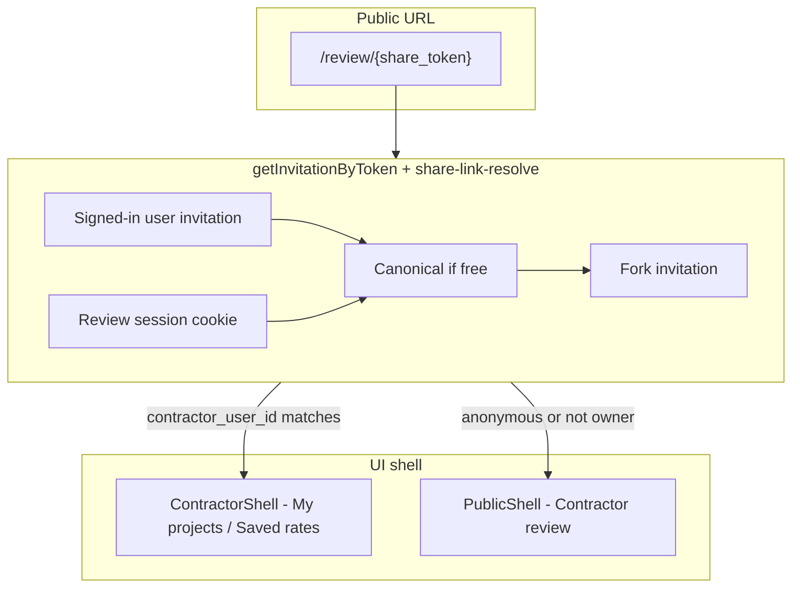

# Contractor & Share-Link Flows — Retro & Engineering Guide

This document captures lessons from Phase 3–5 contractor portal work (June 2026). Use it when changing auth, review pages, share links, onboarding, or contractor navigation.

---

## What we shipped

Contractors can open a homeowner’s share link, claim a review, build an estimate, and submit — without a prior account. Multiple contractors can use the **same copied URL**. Logged-in contractors manage reviews from **My projects** with the full portal shell (My projects, Saved rates).

That required fixing several interacting bugs, not one root cause.

---

## Retro: issues we hit

| # | Symptom | What we thought | Actual cause |
|---|---------|-----------------|--------------|
| 1 | “My projects” / “Your projects” reloaded the same review | Broken link or bad router | Stale `sessionStorage` return URL + `auth()` failing in middleware on production → redirect loops |
| 2 | After share-link signup, forced into full onboarding | Signup broken | **Two profile tiers** conflated: claim needs name+company; portal needs service area + `onboarding_completed_at` |
| 3 | Homeowner “Reviewed scopes” tab empty while logged in | Data or RLS bug | API route used `auth()` only; client needed `authenticatedFetch` + server needed `ensureUserRecord` fallback |
| 4 | Second contractor on same link saw first contractor’s submission | Token collision | One invitation per share URL; needed **fork invitations** per contractor while keeping public URL stable |
| 5 | Opening owned review from portal showed “Contractor review” public nav | Wrong shell component | Review page used `auth()` only and `getInvitationByToken(token)` without request → treated user as logged out |

**Theme:** Each bug looked like a single broken feature. In practice, production Clerk proxy behavior, share-link identity resolution, profile gates, and client redirect state all had to be correct at once.

---

## Root causes (read before changing this area)

### 1. Production auth ≠ local dev

On `scopebuddy.ai`, Clerk runs through a **frontend API proxy** (`/__clerk`). In several contexts, `auth()` from `@clerk/nextjs/server` returns **no user** even when the browser session is valid:

- Middleware (partially — we added fallback)
- Many API route handlers
- Some server components (e.g. review page shell)

**Do not rely on `auth()` alone** outside route handlers that already use the full pattern.

**Use instead:**

```typescript
// API routes — pass the incoming Request
const userId = await requireAuth(request);
// or
const userId =
  (await resolveClerkUserId(request)) ??
  (await resolveClerkUserIdFromHeaders());

// Server components without Request — build one from headers()
const userId =
  (await auth()).userId ?? (await resolveClerkUserIdFromHeaders());
```

Canonical helpers live in `lib/auth/clerk.ts`. Middleware already uses `authUserId ?? resolveClerkUserId(request)` — mirror that everywhere.

### 2. Public routes still need logged-in behavior

`/review/*` is a **public route** in middleware (contractors arrive unauthenticated). That is correct for access, but:

- **Shell:** owned reviews → `ContractorShell`; anonymous / unclaimed → `PublicShell`
- **Redirects:** homeowners who own the project should leave `/review` for the dashboard
- **APIs:** review endpoints must accept cookie session **and** bearer token from `authenticatedFetch`

Changing middleware to “protect” review routes would break the share-link funnel. Fix behavior **inside** the route, not by locking the path.

### 3. Share URL token ≠ invitation row

Homeowners copy `/review/{project.share_token}`. That token is stable. Each contractor gets their own **invitation** (canonical or forked):

- First visitor may get the canonical invitation tied to the share token
- Later visitors get a **fork** with a new internal `invitation_token` while the **browser URL stays the share token**

Resolution order (see `lib/contractor/share-link-resolve.ts`):

1. Signed-in user’s existing invitation for this project
2. Review session cookie (bound to resolved invitation token)
3. Canonical invitation if still “free”
4. Otherwise create / return a fork

**Always pass `request` into `getInvitationByToken(token, request)`** when the viewer might be signed in or have a review session cookie. Without it, you resolve the wrong invitation (often the canonical one another contractor owns).

### 4. Two contractor profile gates

| Helper | Required fields | Used for |
|--------|-----------------|----------|
| `hasShareLinkClaimProfile` | `company_name`, `contact_name` | Claim review on share link |
| `isContractorProfileReady` | above + `service_area` + `onboarding_completed_at` | Contractor portal (`/contractor/*`) |

Collect **service area on the share-link intro** before signup when possible. Sending users to portal onboarding without it blocks “My projects” after they thought they finished signup.

### 5. sessionStorage redirect state

Keys in `lib/contractor/share-link-onboarding.ts`:

- `scopemate-share-link-return` — return URL after auth
- `scopemate-share-link-pending-unlock` — post-signup claim flow
- `scopemate-contractor-signup` — prefill + service area (`lib/contractor/signup-prefill.ts`)

If `shareLinkReturn` is left set when entering the contractor portal, nav links can bounce back to an old review URL.

**Clear on:** portal entry, successful claim, complete-setup, and when abandoning share-link onboarding (`clearShareLinkReturn`, etc.).

### 6. Client fetches on authenticated pages

Cookie sessions do not always reach client-initiated API calls reliably on the production domain. Components that load private data after hydration should use:

```typescript
authenticatedFetch(getToken, "/api/...", { ... })
```

See `lib/auth/authenticated-fetch-client.ts`, `components/review/reviewed-project-scopes-section.tsx`, `components/project/project-detail-tabs.tsx`.

---

## Architecture snapshot



---

## Checklist: before merging contractor / auth / review changes

### Auth

- [ ] Server code uses `requireAuth(request)` or `resolveClerkUserId` + `resolveClerkUserIdFromHeaders` — not raw `auth()` alone
- [ ] API routes that skip middleware auth still authenticate inside the handler
- [ ] Client components that fetch private data use `authenticatedFetch` where needed

### Share links & invitations

- [ ] `getInvitationByToken(token, request)` receives a `Request` when viewer identity matters
- [ ] Multi-contractor behavior preserved: same share URL, separate invitations / reviews
- [ ] Review session cookie uses the **resolved** invitation token, not assumed canonical

### Profile & onboarding

- [ ] Change distinguishes **claim profile** vs **portal-ready profile**
- [ ] New required fields collected on the share-link path if they gate portal access

### Navigation & shells

- [ ] Logged-in contractor viewing **their** review uses `ContractorShell`
- [ ] Breadcrumbs / tabs go to `/contractor`, not back to a stale review URL
- [ ] sessionStorage redirect keys cleared when entering contractor workspace

### Testing mindset

- [ ] Exercise flows **signed in and signed out**
- [ ] Exercise **second contractor** on the same share link (private window)
- [ ] Remember: localhost may hide auth bugs that appear only on `scopebuddy.ai` with the Clerk proxy

---

## Code map

| Area | Primary files |
|------|----------------|
| Auth helpers | `lib/auth/clerk.ts`, `lib/auth/authenticated-fetch-client.ts` |
| Middleware | `middleware.ts` |
| Share resolution | `lib/contractor/share-link-resolve.ts`, `lib/contractor/invitations.ts` |
| Review access | `lib/contractor/review-access.ts`, `lib/contractor/review-session.ts` |
| Profile gates | `lib/contractor/profile.ts` |
| Share onboarding | `lib/contractor/share-link-onboarding.ts`, `components/review/contractor-share-link-onboarding-dialog.tsx` |
| Review page shell | `app/review/[token]/page.tsx` |
| Contractor shell | `components/contractor/contractor-shell.tsx`, `contractor-nav-tabs.tsx` |

---

## Known audit backlog

These still use `auth()` or `getInvitationByToken(token)` without request in some paths. They may be fine for localhost but are **higher risk** on production — update when touching them:

- `lib/contractor/review-homeowner-redirect.ts`
- `lib/contractor/suggestions.ts` (multiple call sites)
- `app/(dashboard)/projects/page.tsx`, `app/page.tsx` (dashboard entry redirects)

When fixing one, apply the full pattern from this doc, not a one-line patch.

---

## Commits that fixed the original issues

| Commit | Fix |
|--------|-----|
| `7c83981` | Contractor nav bounce: middleware cookie fallback, clear stale share-link return |
| `c598c0b` | Service area on share-link signup; homeowner reviewed scopes auth |
| `9769ca7` | Multi-contractor share link via forked invitations |
| `cba600c` | Contractor shell on review page for logged-in owners |

---

## How to change this area safely

1. **Read this doc** and the file you’re editing in the code map.
2. **Trace both personas:** anonymous contractor via share link, logged-in contractor in portal.
3. **Trace identity end-to-end:** URL token → invitation resolution → session cookie → shell → API auth.
4. **Prefer extending existing helpers** (`requireAuth`, `getInvitationByToken`, share-link-resolve) over new one-off checks.
5. **Do not “fix” auth by making `/review` private** — that breaks the funnel.

If a change touches two of {auth, share resolution, onboarding, shell}, treat it as a cross-cutting change and walk the checklist above.
