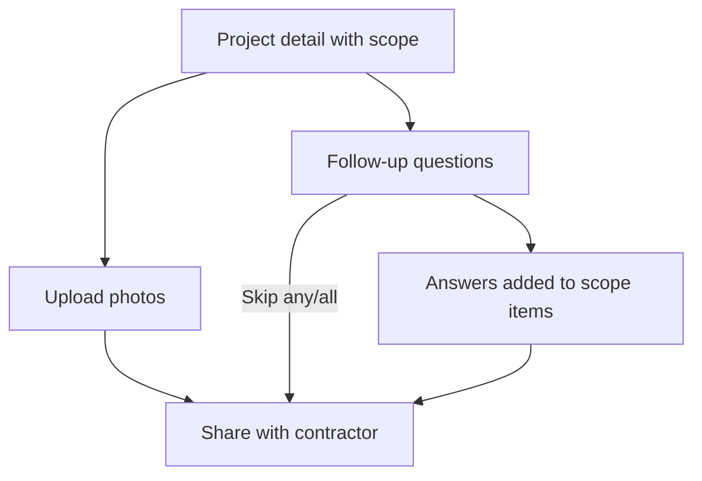

# ScopeBuddy - Phase 2 Plan

## Optional Context + Photos

**Status:** Complete. Run `node scripts/setup-phase2.mjs` (migrations 002-005 + storage bucket) before first deploy.

---

## Why Phase 2 exists

Phase 1 proved the core loop: describe -> generate scope -> edit -> share.

Phase 2 helps homeowners **add optional context before sharing** - without turning the experience into a form-heavy interrogation or implying the project is incomplete. The product should feel like ScopeBuddy is gently suggesting: *"These details can help contractors quote more accurately."*

### Phase 2 success criteria

- A homeowner can upload photos and answer optional follow-up questions.
- Follow-up answers appear in scope items (linked via `follow_up_question_id`).
- **No exact measurements are required.** "Not sure" is always valid.
- Share links include scope, summary, and photos (read-only) for contractors.
- Sharing is never blocked by missing optional information.

### Explicitly out of scope (Phase 2)

- Completeness scores, percentages, or quote-readiness meters
- Checklist-style "Information That Would Improve Quotes" aggregate UI (replaced by dedicated sections)
- AI photo analysis / computer vision
- Contractor accounts, invitations, or suggestions (Phase 3)
- Pricing, estimates, or cost tiers (Phases 4-5)
- Payments, scheduling, permits, change orders

---

## Product principles (Phase 2)

| Principle | What it means in the UI |
|---|---|
| Never require measurements | Use Small / Medium / Large / Not Sure - never sq ft, inches, or "enter dimensions" |
| Everything is optional | Homeowner can skip any item; sharing always works |
| No scoring or judgment | No percentage, no "almost ready," no implied project quality |
| Photos support the story | Upload is easy; photos appear on share view; no AI claims from images yet |
| Preserve homeowner trust | AI marks uncertainty; user edits are never silently overwritten |
| Coach, don't gatekeep | Helpful suggestions only - never "you can't share yet" |

---

## User experience overview

### Project detail page (after scope generation)

Sections appear in order:

1. **Scope items** - summary, editable scope, "Add more to scope"
2. **Follow-up questions** - one-at-a-time carousel; answers sync to scope; confirmation interstitial after each answer
3. **Project photos** - drag-and-drop upload; tap-to-expand lightbox
4. **Share with a contractor** - floating dock at bottom of scroll



### Follow-up question flow

- Questions auto-generate after scope generation (max 3, deduped by category).
- One question shown at a time with prev/next navigation and "N left" counter.
- After answering (not skipping): checkmark interstitial -> "Your response has been added to the scope above" -> next question.
- Scope items from answers show **"From your answer"** attribution.
- Completion state: "Well done. All questions answered."

### Contractor share view

- Project header (title, status badge, type, city/state)
- AI summary
- Scope of work (grouped by category)
- Project photos (grid + lightbox, or "No photos were shared" empty state)
- Photos load server-side with the page (no client-side pop-in)

---

## Database schema (Phase 2)

| Migration | Purpose |
|---|---|
| `002_location_field.sql` | `location`, `city`, `state` on projects |
| `003_phase2_quote_improvement_photos.sql` | `project_photos` table |
| `004_remove_completeness_score.sql` | Drops legacy completeness columns; adds `category` on follow-ups if missing |
| `005_follow_up_scope_link.sql` | `follow_up_question_id` on `scope_items` |

### Supabase Storage

- Bucket: `project-photos` (private)
- Signed URLs via server

Run all migrations:

```bash
node scripts/setup-phase2.mjs
```

Requires `DATABASE_URL` in `.env.local` for SQL migrations.

---

## API endpoints (Phase 2)

| Method | Endpoint | Auth | Description |
|---|---|---|---|
| `GET` | `/api/projects/[id]/photos` | Homeowner | List photos with signed URLs |
| `POST` | `/api/projects/[id]/photos` | Homeowner | Upload photo |
| `DELETE` | `/api/projects/[id]/photos/[photoId]` | Homeowner | Delete photo |
| `GET` | `/api/projects/[id]/follow-up-questions` | Homeowner | List questions |
| `POST` | `/api/projects/[id]/follow-up-questions/generate` | Homeowner | AI generates questions |
| `PATCH` | `/api/projects/[id]/follow-up-questions/[questionId]` | Homeowner | Save answer or skip; syncs scope item |
| `POST` | `/api/projects/[id]/follow-up-questions/sync-scope` | Homeowner | Backfill scope items from answers |
| `GET` | `/api/share/[token]` | Public | Project JSON + photos (API still available) |

**Removed:** `/api/projects/[id]/completeness`, `/api/projects/[id]/quote-improvement`, `completeness_score` in responses.

---

## Component hierarchy (Phase 2)

```
components/
  scope/
    scope-editor.tsx
    scope-item-row.tsx          # "From your answer" attribution
    add-more-to-scope-section.tsx
  follow-up/
    follow-up-questions-panel.tsx
    follow-up-question-card.tsx
    follow-up-scope-added-confirmation.tsx
    dimension-estimate-buttons.tsx
  photos/
    photo-upload-section.tsx    # lightbox + inline delete confirm
  project/
    share-link-dock.tsx
    share-link-panel.tsx        # Turn off sharing in floating dock
  share/
    shared-project-view.tsx
    shared-photo-gallery.tsx
    shared-scope-list.tsx
```

---

## Phase 2 polish (complete)

- [x] Follow-up answers sync to scope items
- [x] Confirmation interstitial with fade in/out after each answer
- [x] Scope item attribution: "From your answer"
- [x] Photo lightbox on homeowner upload page
- [x] Share page: server-side photo loading
- [x] Share page: empty photo state for contractors
- [x] Floating share dock: Turn off sharing
- [x] Inline photo delete confirmation (no native `confirm()`)
- [x] Follow-up intro copy aligned with optional framing
- [x] Docs updated to match shipped UI

---

## Phase 2 test plan

- [x] No percentage or progress bar on follow-ups
- [x] Sharing works with all follow-ups skipped and no photos
- [x] Photos upload/delete; lightbox on project page and share page
- [x] Follow-up auto-generates; skip / Not sure allowed
- [x] No exact measurement fields
- [x] Answers appear in scope items with correct attribution
- [x] Share page shows empty photo message when none uploaded
- [x] Floating share dock includes Turn off sharing

---

## Approval

- [x] Design decisions confirmed (2026-06-05)
- [x] Approved to build Phase 2 (2026-06-05)
- [x] Completeness score removed from product plan (2026-06-05)
- [x] Phase 2 polish pass complete (2026-06-05)
