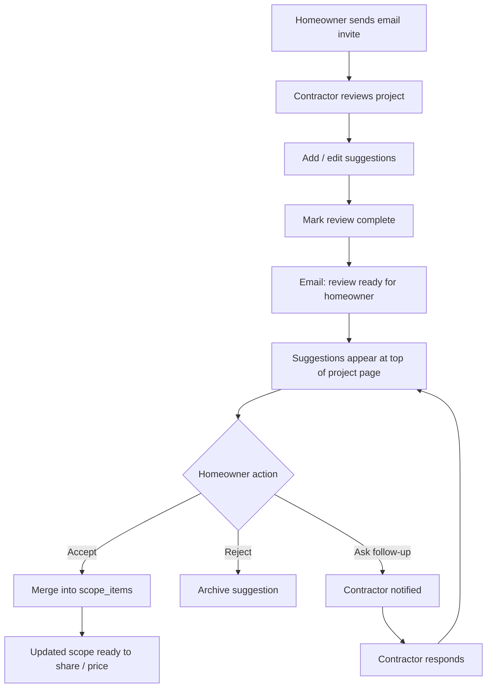

# ScopeBuddy - Phase 3 Plan

## Contractor Collaboration

**Status:** In progress — PR A foundation shipped (invitations, review page, suggestions workflow).

**Depends on:** Phase 2 complete (scope, follow-ups, photos, share links, migrations 002-005).

---

## Why Phase 3 exists

Phase 1 proved the homeowner loop. Phase 2 added optional context. Phase 3 closes the loop with contractors:

> Homeowner defines scope -> contractor reviews and suggests improvements -> homeowner approves -> scope is ready to price.

Today, contractors only get a **read-only share link**. They cannot leave structured feedback inside ScopeBuddy, and homeowners cannot accept contractor input without manually editing scope items.

Phase 3 introduces **invited contractor review** and a **suggestion + approval workflow** — without pricing, estimates, or full contractor accounts yet.

### Phase 3 success criteria

- A homeowner can invite a contractor by email and track invitation status.
- A contractor can open the invite, add suggestions, and **mark review complete**.
- Suggestions are **delivered to the homeowner only after** the contractor marks review complete.
- A homeowner reviews suggestions at the **top of the project page** and can **Accept**, **Reject**, or **Ask follow-up** on each item.
- Approved suggestions merge into scope items; follow-ups go back to the contractor for a response.
- The existing **public share link** continues to work as anonymous read-only access.

### Explicitly out of scope (Phase 3)

- Contractor Clerk accounts or login (defer to Phase 6 / Contractor Pro)
- Estimates, line items, or pricing (Phase 5)
- Cost tiers or planning ranges (Phase 4)
- AI-assisted bid generation
- In-app messaging or chat threads *(structured follow-up per suggestion only — not a general inbox)*
- Contractor editing scope directly
- Homeowner auto-accept of suggestions
- Multiple contractors negotiating on the same suggestion
- Change orders, scheduling, payments, permits filing

---

## Design decisions (confirmed 2026-06-05)

| # | Decision | Choice | Rationale |
|---|---|---|---|
| 1 | Contractor identity | **Lightweight capture on invite open** (name, email, optional company) | Keeps review friction low; no signup wall for MVP |
| 2 | Access model | **Two paths:** public share (read-only) + invite link (review + suggest) | Share link stays simple; invites enable collaboration |
| 3 | Scope changes | **Suggestions only** — homeowner approves before merge | Preserves homeowner trust; matches product brief |
| 4 | Suggestion types | **Add, edit, remove, note** | Covers common contractor feedback patterns |
| 5 | Invite delivery | **Email invite + copy link** on project page | Contractor gets a direct email; homeowner can still copy link |
| 6 | Invite expiry | **30 days** from creation | Balances security and realistic review timelines |
| 7 | Invite scope | **One project per invitation** | Simple permissions model |
| 8 | Contractor UI | **Dedicated review route** `/review/[token]` | Clear separation from homeowner dashboard |
| 9 | Review completion | **Required** — contractor marks review complete before homeowner sees suggestions | Avoids partial/in-progress feedback confusing the homeowner |
| 10 | Suggestion visibility | **Hidden from homeowner until review complete** | Homeowner gets a complete batch to respond to |
| 11 | Edit suggestions | **Yes, while review is in progress** (before mark complete) | Contractors can refine before submitting |
| 12 | Homeowner actions | **Accept, Reject, or Ask follow-up** per suggestion | Approve scope changes or request clarification |
| 13 | Suggestions placement | **Top of project page** (first content section below header) | Highest visibility for homeowner decisions |
| 14 | Accepted suggestions | **New or updated `scope_items` with `source: contractor`** | Reuses existing scope model and share view |
| 15 | Level 0 vs 1 | **Phase 3 ships Level 1 only via invites**; share link remains Level 0 | Aligns with ARCHITECTURE access levels |

---

## Product principles (Phase 3)

| Principle | What it means in the UI |
|---|---|
| Homeowner owns the scope | Contractors suggest; they never save directly to scope |
| Low friction for contractors | Open link, identify yourself, review, suggest — no account required |
| Clear attribution | Accepted items show they came from the contractor |
| Actionable feedback | Each suggestion is accept, reject, or ask follow-up — not an open-ended chat |
| Share link unchanged | Public link still works for quick peeks; invite is for collaboration |
| Transparent state | Homeowner sees invitation status; suggestions appear when review is submitted |

---

## User experience overview

### Relationship to existing share link

| | Public share `/share/[token]` | Contractor invite `/review/[token]` |
|---|---|---|
| Auth | None | Lightweight identity form (first visit) |
| View scope, photos, summary | Yes | Yes |
| Submit suggestions | No | Yes |
| General review notes | No | Yes |
| Who creates it | Homeowner (share dock) | Homeowner (invite section) |
| Revocable | Turn off sharing / regenerate | Revoke or expire invitation |

Both can be active on the same project.

### Primary journeys

#### Homeowner

1. Project is scope-ready (Phase 1 + 2 complete).
2. Homeowner opens **Invite a contractor** (below photos / near share area).
3. Enters contractor name + email → **Send invitation** (email sent + copy link available).
4. Sees invitation status: *Waiting for review*, *Review in progress*, or *Review submitted*.
5. When contractor **marks review complete**, **Contractor suggestions** appears at the **top** of the project page.
6. For each suggestion: **Accept** (merges into scope), **Reject**, or **Ask follow-up** (sends question back to contractor).
7. If follow-up requested, contractor responds via review link; suggestion returns to homeowner queue.
8. Homeowner continues to share public link or send updated scope.

#### Contractor

1. Receives **email invitation** with link to `/review/[token]` (expires in 30 days).
2. First visit: confirms name, email, optional company name.
3. Reviews project (same visual language as share page).
4. Adds suggestions (add / edit / remove / note). Can **edit or withdraw** suggestions while review is in progress.
5. Optionally adds general review notes.
6. Clicks **Mark review complete** — locks the review batch and notifies homeowner.
7. If homeowner asks follow-up on a suggestion, contractor returns via same link to respond.



---

### Project page section order (updated)

1. **Contractor suggestions** *(visible only after at least one submitted review)*
2. Scope items
3. Follow-up questions
4. Project photos
5. Invite a contractor
6. Share with a contractor (floating dock)

---

### 1. Project detail — Contractor suggestions (new)

**Placement:** **Top of page** — first section below project header.

**Visibility:**

- Hidden until a contractor marks review complete for this project.
- Shows pending count badge when new reviews arrive.

**Contents:**

- Suggestions grouped by contractor / review batch
- Each card: type (add/edit/remove/note), proposed change, contractor note, follow-up thread (if any)
- Actions: **Accept** / **Reject** / **Ask follow-up**
- Ask follow-up opens inline textarea; sends question to contractor
- Accepted/rejected history (collapsed by default)

**Accept behavior:**

| Suggestion type | Scope effect |
|---|---|
| Add | Insert new `scope_item`, `source: contractor`, link `suggestion_id` |
| Edit | Update target item text; preserve history in suggestion record |
| Remove | Set target item `status: removed` (soft delete) |
| Note | No scope change; stored as resolved note |

**Follow-up behavior:**

- Homeowner question stored in `suggestion_follow_ups` with `author_role: homeowner`
- Suggestion status → `follow_up_requested`
- Contractor receives email notification with link back to review
- Contractor reply stored with `author_role: contractor`; status → `pending` (back in homeowner queue)

---

### 2. Project detail — Invite a contractor (new)

**Placement:** Below photos, above share dock.

**Contents:**

- Section title: **Invite a contractor**
- Intro: *Send an email invitation so they can review your scope and suggest improvements. Separate from your public share link.*
- Form: contractor name, email, optional company
- **Send invitation** → sends email + shows invite URL with Copy link
- List of invitations with status:
  - `pending` — invite sent, contractor hasn't opened
  - `in_review` — contractor opened, review not yet complete
  - `submitted` — review complete; suggestions delivered
  - `revoked` / `expired`
- Shows expiry date (30 days from send)
- Actions: Copy link, Resend email, Revoke

**Rules:**

- Multiple active invitations allowed (different contractors).
- Default expiry: **30 days** from creation.
- Revoking invalidates the invite token immediately.

---

### 3. Contractor review page — `/review/[token]` (new)

**Layout:** Reuse `PublicShell` + patterns from `SharedProjectView`.

**Sections:**

- Header: project title, type, location, "Reviewing as [Name]"
- Summary, scope (read-only with item targeting for edit/remove suggestions), photos
- **Your suggestions** panel — draft suggestions (editable until review complete)
- **Add suggestion** affordances on scope rows and "Add scope item" action
- General review notes field
- Primary CTA: **Mark review complete** (enabled when at least one suggestion or note exists)
- After submit: review is read-only; contractor can still respond to follow-ups

**Expired / revoked state:** Friendly message matching share expired pattern.

---

### 4. Contractor identity gate (first visit)

Simple inline form before full review UI:

- Confirm name (pre-filled from invite)
- Confirm email (pre-filled from invite)
- Optional company name
- **Continue to review** — stores identity on invitation record, sets session cookie scoped to invite token

No Clerk signup.

---

## Database schema (Phase 3)

### Migration: `006_phase3_contractor_collaboration.sql`

#### Extend `scope_items`

| Column | Type | Notes |
|---|---|---|
| `suggestion_id` | `uuid` FK -> `scope_suggestions.id` NULL | Set when item created from accepted suggestion |

#### `contractor_invitations`

| Column | Type | Notes |
|---|---|---|
| `id` | `uuid` PK | |
| `project_id` | `uuid` FK -> `projects.id` ON DELETE CASCADE | |
| `invited_by` | `uuid` FK -> `users.id` | Homeowner who sent invite |
| `contractor_name` | `text` NOT NULL | Display name |
| `contractor_email` | `text` NOT NULL | |
| `contractor_company` | `text` | Nullable; filled on accept |
| `invitation_token` | `text` UNIQUE NOT NULL | URL-safe random token |
| `status` | `text` NOT NULL DEFAULT `'pending'` | `pending`, `accepted`, `in_review`, `submitted`, `revoked`, `expired` |
| `accepted_at` | `timestamptz` | First time contractor completed identity gate |
| `last_accessed_at` | `timestamptz` | |
| `expires_at` | `timestamptz` NOT NULL | Default: `now() + 30 days` |
| `created_at` | `timestamptz` DEFAULT `now()` | |
| `updated_at` | `timestamptz` DEFAULT `now()` | |

#### `contractor_reviews`

One row per invitation per project — overall review metadata.

| Column | Type | Notes |
|---|---|---|
| `id` | `uuid` PK | |
| `project_id` | `uuid` FK -> `projects.id` ON DELETE CASCADE | |
| `invitation_id` | `uuid` FK -> `contractor_invitations.id` UNIQUE | One review per invite |
| `notes` | `text` | General feedback |
| `status` | `text` NOT NULL DEFAULT `'in_progress'` | `in_progress`, `submitted` |
| `submitted_at` | `timestamptz` | When contractor marked review complete |
| `created_at` | `timestamptz` DEFAULT `now()` | |
| `updated_at` | `timestamptz` DEFAULT `now()` | |

#### `scope_suggestions`

| Column | Type | Notes |
|---|---|---|
| `id` | `uuid` PK | |
| `project_id` | `uuid` FK -> `projects.id` ON DELETE CASCADE | |
| `invitation_id` | `uuid` FK -> `contractor_invitations.id` | |
| `target_scope_item_id` | `uuid` FK -> `scope_items.id` NULL | For edit/remove |
| `suggestion_type` | `text` NOT NULL | `add`, `edit`, `remove`, `note` |
| `category` | `text` | For add suggestions |
| `suggested_text` | `text` | Proposed scope text or note body |
| `contractor_note` | `text` | Why they're suggesting this |
| `status` | `text` NOT NULL DEFAULT `'draft'` | `draft`, `pending`, `follow_up_requested`, `accepted`, `rejected`, `withdrawn` |
| `homeowner_rejection_reason` | `text` | Optional note when rejected |
| `resolved_at` | `timestamptz` | |
| `resolved_by` | `uuid` FK -> `users.id` NULL | Homeowner who accepted/rejected |
| `created_at` | `timestamptz` DEFAULT `now()` | |
| `updated_at` | `timestamptz` DEFAULT `now()` | |

#### `suggestion_follow_ups`

Structured back-and-forth on a single suggestion (not a general chat).

| Column | Type | Notes |
|---|---|---|
| `id` | `uuid` PK | |
| `suggestion_id` | `uuid` FK -> `scope_suggestions.id` ON DELETE CASCADE | |
| `author_role` | `text` NOT NULL | `homeowner`, `contractor` |
| `message` | `text` NOT NULL | |
| `created_at` | `timestamptz` DEFAULT `now()` | |

**Suggestion status flow:**

```
draft (contractor, pre-submit) -> pending (homeowner queue, post review complete)
pending -> follow_up_requested (homeowner asks question)
follow_up_requested -> pending (contractor responds)
pending -> accepted | rejected
```

**Indexes:** `(project_id, status)`, `(invitation_id)`, `(suggestion_id)` on follow_ups.

---

## Email notifications (Phase 3 MVP)

Use **Resend** (or equivalent transactional provider) via server-side API only.

| Trigger | Recipient | Content |
|---|---|---|
| Invitation created | Contractor | Project title, homeowner name, review link, 30-day expiry note |
| Review marked complete | Homeowner | Contractor name, project title, link to project suggestions |
| Follow-up requested | Contractor | Homeowner question preview, link to review page |
| Follow-up answered | Homeowner | Contractor response preview, link to project |

**Env vars:** `RESEND_API_KEY`, `EMAIL_FROM` (verified domain).

Invitation email is sent on **Send invitation**; copy-link remains available as fallback.

---

## API endpoints (Phase 3)

### Homeowner (Clerk auth, project ownership)

| Method | Endpoint | Description |
|---|---|---|
| `GET` | `/api/projects/[id]/invitations` | List invitations for project |
| `POST` | `/api/projects/[id]/invitations` | Create invitation, send email, set 30-day expiry |
| `POST` | `/api/projects/[id]/invitations/[invitationId]/resend` | Resend invitation email |
| `DELETE` | `/api/projects/[id]/invitations/[invitationId]` | Revoke invitation |
| `GET` | `/api/projects/[id]/suggestions` | List suggestions **only from submitted reviews** |
| `POST` | `/api/projects/[id]/suggestions/[suggestionId]/accept` | Accept + merge to scope |
| `POST` | `/api/projects/[id]/suggestions/[suggestionId]/reject` | Reject suggestion |
| `POST` | `/api/projects/[id]/suggestions/[suggestionId]/follow-up` | Ask follow-up question |

### Contractor (invitation token auth — cookie or `Authorization: Bearer <token>`)

| Method | Endpoint | Description |
|---|---|---|
| `GET` | `/api/review/[token]` | Project payload for review (scope, photos, own suggestions) |
| `POST` | `/api/review/[token]/identity` | Complete identity gate |
| `GET` | `/api/review/[token]/suggestions` | Contractor's suggestions on this project |
| `POST` | `/api/review/[token]/suggestions` | Create suggestion |
| `PATCH` | `/api/review/[token]/suggestions/[id]` | Edit draft suggestion (before review complete) |
| `DELETE` | `/api/review/[token]/suggestions/[id]` | Withdraw draft suggestion |
| `PUT` | `/api/review/[token]/notes` | Update general review notes |
| `POST` | `/api/review/[token]/complete` | Mark review complete; notify homeowner |
| `POST` | `/api/review/[token]/suggestions/[id]/follow-up` | Contractor responds to homeowner follow-up |

**Security:**

- Validate invitation token server-side on every contractor route.
- Reject revoked/expired invitations with 404 (same as share link pattern).
- Homeowner routes verify `project.homeowner_id === user.id`.
- Rate-limit suggestion creation per invitation.

---

## Component hierarchy (Phase 3)

```
app/
  review/[token]/page.tsx              # Contractor review page
  api/
    review/[token]/...
    projects/[id]/invitations/...
    projects/[id]/suggestions/...

components/
  contractor/
    contractor-invite-section.tsx      # Homeowner: create + list invites
    contractor-invite-form.tsx
    contractor-invite-row.tsx
  suggestions/
    suggestions-inbox.tsx              # Homeowner: top-of-page inbox
    suggestion-card.tsx
    suggestion-actions.tsx             # Accept / Reject / Ask follow-up
    suggestion-follow-up-thread.tsx
  review/
    contractor-review-view.tsx         # Full review layout
    contractor-identity-gate.tsx
    review-scope-list.tsx              # Read-only scope with suggest actions
    review-suggestion-form.tsx
    review-suggestions-panel.tsx
    review-expired-notice.tsx

lib/
  contractor/
    invitations.ts                     # CRUD, token validation, expiry
    suggestions.ts                     # Create, accept, reject, merge, follow-up
    review-session.ts                  # Cookie/session for invite token
  email/
    send-invitation.ts
    send-review-complete.ts
    send-follow-up.ts
  validators/
    invitation.ts
    suggestion.ts
```

**Reuse from Phase 2:**

- `SharedPhotoGallery`, `ScopeSummary`, `PageSection`, `SectionSurface`
- `listProjectPhotosWithUrls`, `getProjectByShareToken` patterns adapted for invite token

---

## Build sequence

| Step | Task | Delivers |
|---|---|---|
| 1 | Design decision sign-off | Locked choices in this doc |
| 2 | Migration `006` + types | Schema ready |
| 3 | Email provider setup (Resend) | Transactional email working |
| 4 | Invitation lib + API + email | Send/resend/revoke invitations |
| 5 | Homeowner invite UI | Send invitation + status list |
| 6 | Review token API + identity gate | Contractor can open project |
| 7 | Contractor review page (read-only) | Parity with share view + identity |
| 8 | Suggestion API (draft CRUD) | Contractors can build suggestions |
| 9 | Mark review complete + homeowner notify | Batch delivery gate |
| 10 | Homeowner suggestions inbox (top of page) | Accept / reject / ask follow-up |
| 11 | Follow-up thread + contractor respond | Clarification loop |
| 12 | Accept/reject + scope merge | Closes the loop |
| 13 | Scope attribution UI | "Suggested by [Contractor]" on merged items |
| 14 | Polish + test plan | Ready for Phase 4/5 |

**Recommended MVP slice (if splitting PRs):**

1. PR A: Email invites + review page (read-only) + identity gate
2. PR B: Draft suggestions + mark review complete + homeowner inbox
3. PR C: Follow-up loop + accept/reject merge + attribution

---

## Scope item attribution (Phase 3)

Extend `ScopeItemRow` (homeowner view):

| Condition | Label |
|---|---|
| `follow_up_question_id` set | From your answer |
| `source === 'contractor'` or `suggestion_id` set | Suggested by [contractor name] |
| `source === 'homeowner'` | Added by you |
| `source === 'ai'` | (no label, or optional "AI generated") |

Share view: optionally show muted attribution for contractor-sourced items.

---

## Phase 3 test plan

- [ ] Homeowner sends invitation; contractor receives email with valid link
- [ ] Invitation expires after 30 days
- [ ] Revoked invitation shows expired notice
- [ ] Contractor completes identity gate on first visit
- [ ] Contractor sees scope, summary, photos (matches share quality)
- [ ] Contractor creates and edits draft suggestions before review complete
- [ ] Homeowner does **not** see suggestions before review complete
- [ ] Contractor marks review complete; homeowner receives email
- [ ] Suggestions appear at **top** of project page after review complete
- [ ] Homeowner can Accept, Reject, or Ask follow-up on each suggestion
- [ ] Ask follow-up notifies contractor; response returns suggestion to homeowner queue
- [ ] Accept add -> new scope item with `source: contractor`
- [ ] Accept edit -> scope item text updated
- [ ] Accept remove -> item soft-deleted
- [ ] Reject -> suggestion archived, scope unchanged
- [ ] Public share link still works independently
- [ ] No pricing or estimate UI anywhere

---

## Confirmed decisions log

| Question | Decision |
|---|---|
| Suggestions placement | Top of project page |
| Invite expiry | 30 days |
| Email invites | Yes — MVP includes transactional email |
| Review complete | Required before homeowner sees suggestions |
| Edit suggestions | Yes, while review is in progress |
| Homeowner actions | Accept, Reject, or Ask follow-up |

---

## Approval

- [x] Design decisions confirmed (2026-06-05)
- [ ] Approved to build Phase 3

---

## References

- `ROADMAP.md` — Phase 3 summary
- `ARCHITECTURE.md` — roles, access levels, folder structure
- `PROJECT_BRIEF.md` — MVP success: contractor feedback in under 5 minutes
- `SECURITY.md` — invitation token security, RBAC
- `PHASE_2_PLAN.md` — prior phase patterns
